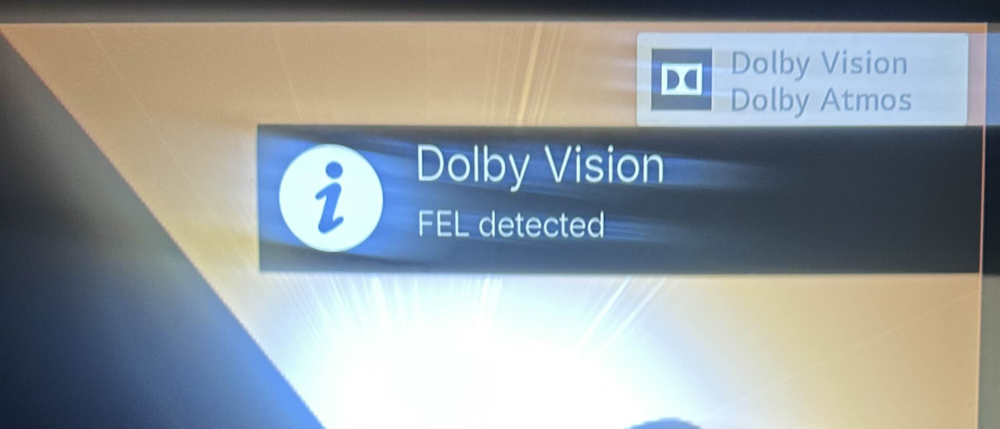
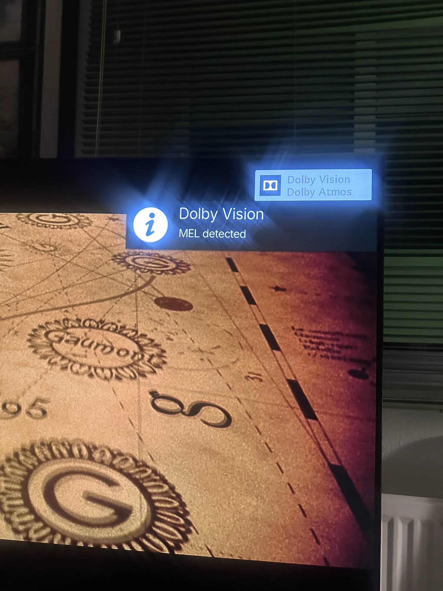

# FEL/MEL Notification Service for Kodi on CoreELEC

A Kodi service add-on that automatically detects and displays Dolby Vision profile type (FEL or MEL) when playback starts on CoreELEC Amlogic devices.

---

## Features

- **Automatic Detection**: Identifies Dolby Vision FEL (Profile 7) or MEL (Profile 8) using CoreELEC system files
- **Unobtrusive Notifications**: Shows a brief notification only at playback start
- **Smart Filtering**: Ignores SDR and HDR10 content to avoid notification spam
- **CoreELEC Optimized**: Designed specifically for CoreELEC Amlogic CPM builds

---

## Example of Notifications

### FEL Detection


### MEL Detection


---

## Requirements

- **CoreELEC** (Amlogic CPM builds)
- **Kodi** 19+ (Python 3.x)
---

## Installation

### 1. Create Add-on Directory

```bash
mkdir -p /storage/.kodi/addons/service.fel_mel_notification
```

### 2. Install Files

Place the following files in `/storage/.kodi/addons/service.fel_mel_notification/`:
- `addon.xml`
- `service.py`
- `README.md` (optional)

### 3. Install Detection Script

Create the detection script:

```bash
nano /storage/.kodi/userdata/fel_mel_notification.sh
```

Paste the script content (see below), then make it executable:

```bash
chmod +x /storage/.kodi/userdata/fel_mel_notification.sh
```

### 4. Restart Kodi

```bash
systemctl restart kodi
```

Or reboot your CoreELEC device.

### 5. Enable the Add-on in Kodi

After restarting Kodi, you need to activate the add-on:

1. Go to **Settings** → **Add-ons**
2. Select **My add-ons**
3. Navigate to **Services**
4. Find **FEL/MEL Notification Service**
5. Click on it and select **Enable**

The add-on will now run automatically in the background and monitor your video playback.

---

## File Contents

### `addon.xml`

```xml
<?xml version="1.0" encoding="UTF-8"?>
<addon id="service.fel_mel_notification" 
       version="1.0.0" 
       name="FEL/MEL Notification Service" 
       provider-name="YourName">
    <requires>
        <import addon="xbmc.python" version="3.0.0"/>
    </requires>
    <extension point="xbmc.service" library="service.py">
        <provides>video</provides>
    </extension>
    <extension point="xbmc.addon.metadata">
        <summary lang="en">Dolby Vision FEL/MEL detection for CoreELEC</summary>
        <description lang="en">Displays FEL or MEL notifications when playing Dolby Vision content on CoreELEC Amlogic devices.</description>
        <platform>all</platform>
        <license>MIT</license>
    </extension>
</addon>
```

### `service.py`

```python
import xbmc
import xbmcgui
import subprocess
import time

# Path to bash script
SCRIPT_PATH = "/storage/.kodi/userdata/fel_mel_notification.sh"

while not xbmc.Monitor().abortRequested():
    # Wait for a player to start
    if xbmc.Player().isPlayingVideo():
        # Execute your script
        subprocess.Popen([SCRIPT_PATH])

        # Wait for playback to finish to avoid running it again
        while xbmc.Player().isPlayingVideo():
            if xbmc.Monitor().abortRequested():
                break
            time.sleep(1)

    time.sleep(1)
```

### `fel_mel_notification.sh`

```bash
#!/bin/bash
DEBUG_PATH="/sys/class/amdolby_vision/debug"
SRC_FMT="/sys/class/video_poll/primary_src_fmt"

# Brief wait at the start for video info to be ready
sleep 3

# Exit if there's no video information
[ ! -f "$SRC_FMT" ] && exit 0

# Read source type
SRC_VALUE=$(cat "$SRC_FMT" 2>/dev/null | tr -d '\0')

# Function to show notification
show_notification() {
    kodi-send --action="Notification($1,$2,10000)"
}

# Only if it's Dolby Vision, check FEL/MEL
if echo "$SRC_VALUE" | grep -qi "Dolby"; then
    BEFORE=$(dmesg | tail -n 300)
    echo dv_el > "$DEBUG_PATH" 2>/dev/null
    sleep 1
    AFTER=$(dmesg | tail -n 300)
    NEW_LOGS=$(echo "$AFTER" | grep -Fvx -f <(echo "$BEFORE"))

    if echo "$NEW_LOGS" | grep -q "el_mode:1"; then
        show_notification "Dolby Vision" "FEL detected"
    elif echo "$NEW_LOGS" | grep -q "el_mode:0"; then
        show_notification "Dolby Vision" "MEL detected"
    fi
fi
```

---

## Usage

1. **Play Dolby Vision content**: A notification will appear showing either "FEL detected" or "MEL detected"
2. **SDR/HDR10 content**: No notification will be displayed
3. **Notification duration**: 10 seconds (adjustable in script)

---

## Troubleshooting

### No Notifications Appearing

Check if the service is running:
```bash
tail -f /storage/.kodi/temp/kodi.log | grep "FEL/MEL"
```

Verify script permissions:
```bash
ls -l /storage/.kodi/userdata/fel_mel_notification.sh
```

### Notifications Appear Too Early

Increase the `sleep` value in `fel_mel_notification.sh`:
```bash
sleep 4  # Increase from 3 to 4 seconds
```

### Testing the Detection Script

Run manually during Dolby Vision playback:
```bash
/storage/.kodi/userdata/fel_mel_notification.sh
```

---

## Customization

### Change Notification Position

Notification position depends on your Kodi skin settings. Check skin documentation for notification placement options.

### Modify Notification Text

Edit the `kodi-send` commands in `fel_mel_notification.sh`:
```bash
kodi-send --action="Notification(Your Title,Your Message,Duration)"
```

---

## Technical Details

- **Detection Method**: Analyzes kernel messages after triggering `dv_el` debug flag
- **FEL Detection**: Looks for `el_mode:1` in dmesg output
- **MEL Detection**: Looks for `el_mode:0` in dmesg output
- **Performance**: Minimal overhead, runs only at playback start

---

## License

MIT License - Free to use, modify, and distribute.

---

## Credits

Created for the CoreELEC community. Contributions welcome!

---

## Support

For issues or questions:
- Check CoreELEC forums
- Review Kodi logs at `/storage/.kodi/temp/kodi.log`
- Verify your device supports Dolby Vision playback
